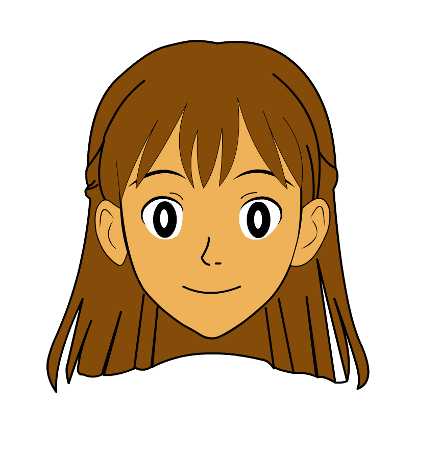
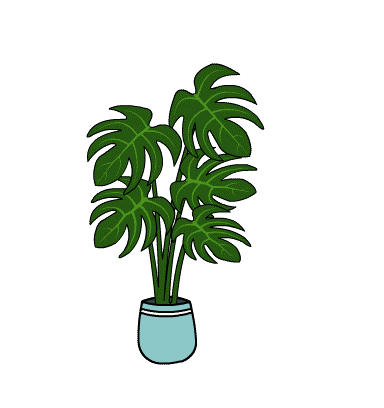

<!DOCTYPE html>
<html lang="en">
<head>
  <meta charset="UTF-8" />
  <meta name="viewport" content="width=device-width, initial-scale=1.0" />
  <title>Edit by Bhawan</title>
  
</head>
<body>

  <!-- Landing Layer -->
  <section id="landing">
    <h1>Welcome to Edit by Bhawan</h1>
    
Explore my creative world through animation & storytelling

    

      <a href="#animation" class="button">🎞 Animation</a>
      <a href="#illustrations" class="button">🖌 Illustrations</a>
      <a href="#testshots" class="button">🎭 Test Shots</a>
      <a href="#booking" class="button">💬 Book Edit</a>
      <a href="https://www.behance.net/bhawnabharti48" target="_blank" class="button">🌐 Behance</a>
    

  </section>

  <!-- Portfolio Starts -->
  <header>
    
    <h1>Bhawan Bharti</h1>
    
Animation • Illustration • Graphic Storytelling

  </header>

  <section id="animation">
    <h2>🎞 Animation Project</h2>
    

      <video controls>
        <source src="rigged cloths_3.mp4" type="video/mp4" />
        Your browser does not support the video tag.
      </video>
    

  </section>

  <section id="illustrations">
    <h2>🖌 Illustrations</h2>
    

      
      
    

  </section>

  <section id="testshots">
    <h2>🎭 Emotional Tests</h2>
    

      
      
    

  </section>

  <section id="tools">
    <h2>🧰 Tools I Use</h2>
    <ul class="tools">
      <li>Adobe Animate</li>
      <li>Adobe Illustrator</li>
      <li>After Effects</li>
      <li>Figma</li>
    </ul>
  </section>

  <section id="booking" style="text-align: center;">
    <h2>💬 Book an Edit</h2>
    <a href="https://wa.me/919263300290" target="_blank" class="button">Chat on WhatsApp</a>
  </section>

  <footer>
    
📧 Contact: bhartibhawna4488@example.com

    
🔗 Portfolio: <a href="https://www.behance.net/bhawnabharti48" target="_blank">Behance</a>

    
&copy; 2025 Edit by Bhawan

  </footer>

</body>
</html>
